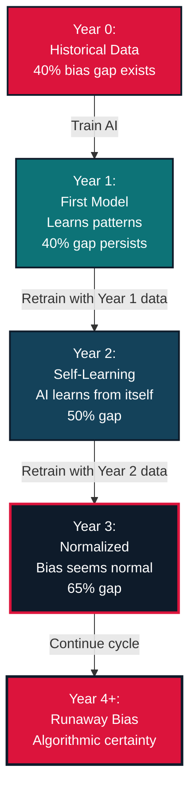

+++ 
date = "2025-11-16"
title = "Using AI for recruitment in Norway? Here is how algorithms inherit our biases"
slug = "ai-discrimination-norwegian-hiring" 
tags = ["AI", "Ethics", "Machine Learning", "Norway"]
categories = ["Product"]
series = ["AI Ethics", "Opinion"]
image = "/library/ai_ethics/ai_ethics_1.png"
mermaid = true
+++

AI is changing how companies hire people. It's happening everywhere, including Norway.

Despite Norway's reputation for equality, [NAVIGATE, a research series at UiO shows clear evidence](https://www.sv.uio.no/iss/english/research/projects/navigate/) of discrimination against ethnic minorities in hiring. Now, as companies increasingly use AI and machine learning to screen job applications, there's a serious problem as these systems learn from the past and the societal data from past is now transformed into digital present with the same bias.

When AI is trained on years of hiring data shaped by decades of underrepresentation of women, immigrants, and candidates from remote parts of Norway, it learns to see those biases as normal patterns. The algorithms don't create new discrimination. They inherit ours.

You might think it's a technical bug or poor design. But most often, AI systems simply learn what we taught them through our own biased decisions.

This matters because recruitment AI is classified as a **"high-risk system"** under the EU AI Act, a recognition that these tools can seriously harm people's lives and careers. The [Norwegian Equality and Anti-Discrimination Ombud's 2024 report](https://ldo.no/content/uploads/2025/05/Algorithms-artificial-intelligence-and-discrimination-report.pdf) on algorithms and discrimination highlights exactly this concern.

Here I'll explain how it can make the recruitment sector in Norway worse and how what we can do about it.

## Stories from the ground

I've heard some people talk about changing their names on their CVs just to get a fair shot at interviews. Young professionals with immigrant backgrounds adopting more "Norwegian-sounding" names just to be considered.

This isn't a made up story, a [2023 study by Thiyagarajah and Orupabo](https://samfunnsforskning.brage.unit.no/samfunnsforskning-xmlui/bitstream/handle/11250/3096863/thiyagarajah-orupabo-2023-promoting-norwegianess-to-get-a-foot-in-the-door-stigma-management-among-young-ethnic%2b%25282%2529.pdf) documented ethnic minority jobseekers systematically downplaying their backgrounds to gain "a foot in the door." Field experiments show jobseekers with immigrant backgrounds receive significantly fewer callbacks, even with identical qualifications ([Midtbøen, 2016](https://www.sv.uio.no/iss/english/research/projects/navigate/)).

## Amplification of Bias

I have now spent quite some years learning about how machine learning models learns from data, technical and ethical consequences of it. When a model makes hiring decisions, over time it creates something we call  "bias amplification", and understanding this feedback loop is critical.

Here's how the cycle works for example:

**Year 0: The Starting Point**  
A company builds an AI hiring system using historical data. This data already contains bias. Women from Northern Norway got 40% fewer interviews than equally qualified men from Oslo in past human led hiring.

**Year 1: First Generation Model**  
The model learns from this biased history. It notices patterns: "Successful candidates tend to be men from Oslo. Women from Tromsø are rare among past hires." The model makes predictions based on these patterns. The gap persists at 40%.

**Year 2: The Amplification Begins**  
The company retrains the model to "improve it" using Year 1's data. But Year 1's data now includes the AI's own biased decisions. The model is learning from itself. The pattern strengthens. The gap grows to 50%.

**Year 3: Normalized Discrimination**  
Another retraining cycle. The model now has two years of its own biased outputs in the training data. The algorithm has learned that this disparity is "normal." The gap reaches 65%.

**Year 4 and Beyond: Runaway Bias**  
Each cycle makes the bias stronger because the model is learning from its own biased outputs. What started as a reflection of human bias becomes algorithmic certainty.

If a company retrain their models quarterly or annually to "improve performance." Without intervention, they're unknowingly building amplification machines.

## Real example in Norwegian tech sector

While women make up around 49 percent of Norway's population ([Statistics Norway – Population by gender](https://www.ssb.no/en/befolkning/folketall/statistikk/befolkning)), only about 22 percent of workers in IT occupations are women ([Statistics Norway – Many more have IT-occupations](https://www.ssb.no/arbeid-og-lonn/sysselsetting/artikler/mange-flere-har-it-yrker)). This contrast shows a clear underrepresentation in the tech sector.

When an AI hiring model is trained on this kind of historically imbalanced data, it tends to learn that "successful candidates" look like the majority group. As a result, qualified applicants from underrepresented regions or demographic groups can be treated as statistically unusual by the model, leading to compounded disadvantage with each retraining cycle. This amplification mechanism is well documented in algorithmic fairness research ([Barocas & Selbst, 2016](https://papers.ssrn.com/sol3/papers.cfm?abstract_id=2477899), [Raghavan et al., 2020](https://dl.acm.org/doi/10.1145/3351095.3372828)).

## Technology and regulation converging

This brings us to the regulatory landscape. Norway, along with the EU, is moving toward requiring AI systems to meet fairness standards, with the EU AI Act specifically addressing bias in high risk applications like hiring. Given that [one in four Norwegian businesses now uses AI](https://practiceguides.chambers.com/practice-guides/artificial-intelligence-2025/norway/trends-and-developments), this isn't a distant concern, it's happening right now.

## Solution: Starting simple with reweighting

While there are multiple techniques and intervention points to help solve this today lets talk about reweighting which is one of the pre-processing techniques. Later in the series of this article we will cover in-processing and pos-processing techniques as well.

After studying about fairness interventions, I've found that you don't need to start with complex solutions. While there are sophisticated approaches for different fairness goals (demographic parity, equal opportunity, individual fairness, the simplest intervention that actually works is something called reweighting. 

Think of it like this. Imagine you're training a model to recognize "qualified candidates" but your training data is heavily skewed:

**Before reweighting:**

Every candidate, regardless of background, contributes equally to the model's learning:

* Oslo male candidate: weight = 1.0
* Oslo female candidate: weight = 1.0  
* Tromsø male candidate: weight = 1.0
* Tromsø female candidate: weight = 1.0

**After reweighting:**

We adjust how much the model learns from each group to balance representation:

* Oslo male candidate: weight = 0.7 *(reduce overrepresentation)*
* Oslo female candidate: weight = 1.1 *(balance gender in majority region)*
* Tromsø male candidate: weight = 2.0 *(boost underrepresented geography)*
* Tromsø female candidate: weight = 3.5 *(address intersectional disadvantage)*

This way, the model learns that a "typical qualified candidate" isn't just someone who looks like the historical majority. It prevents the system from treating "most common" as "most qualified."

## Looking forward

The Norwegian Equality and Anti-Discrimination Ombud's 2024 legal analysis confirms that current discrimination law needs revision to specifically address algorithmic systems, highlighting recruitment AI as a primary concern due to its classification as a high-risk application under EU regulations.

As I think about these insights, my view is that the future of AI in Norwegian hiring will be shaped by three forces:

Firstly, regulatory pressure from the [EU AI Act ](https://artificialintelligenceact.eu/high-level-summary/) , which classifies recruitment and employment-related AI systems as *high-risk* and therefore subject to strict transparency, data quality, and fairness requirements. 

Secondly, a growing national awareness of algorithmic discrimination, highlighted in multiple investigations by the [Norwegian Equality and Anti-Discrimination Ombud](https://ldo.no/content/uploads/2025/05/Algorithms-artificial-intelligence-and-discrimination-report.pdf). 

Finally, the businesses that choose to implement fairness strategies proactively rather than waiting until compliance becomes mandatory.

What is clear is that bias amplification in AI is not just an abstract risk, it appears in real datasets, in real companies, right now. The encouraging part is that practical solutions exist. 

As someone who builds AI systems, we have a responsibility to ensure our models don't amplify the very inequalities we claim to want to eliminate. It starts with acknowledging the problem, understanding the mechanisms, and taking concrete steps toward fairness.

---

**What's your experience with AI in hiring? Have you witnessed these patterns in Norwegian workplaces? I'd love to hear your perspective.**

*This is the first in a series exploring AI fairness. If you're equally or more interested in how technology, fairness in AI systems and geopolitics, feel free to connect with me on LinkedIn.*

**#AIEthics #Norge #Rekruttering #MachineLearning #Diversity #FairnessInAI #NorskArbeidsliv**

---

 
 

________________________

If you enjoy staying updated on technology, business, and the universe, feel free to read me on Substack.

<iframe src="https://pysaurav.substack.com/embed" width="480" height="320" style="border:1px solid #EEE; background:white;" frameborder="0" scrolling="no"></iframe>